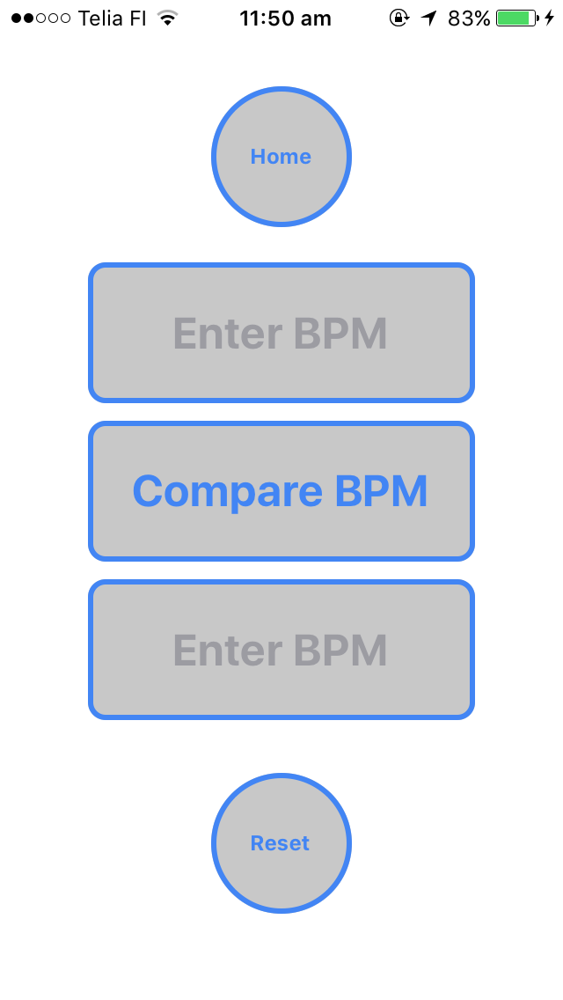
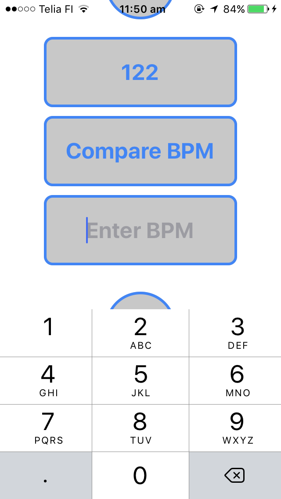
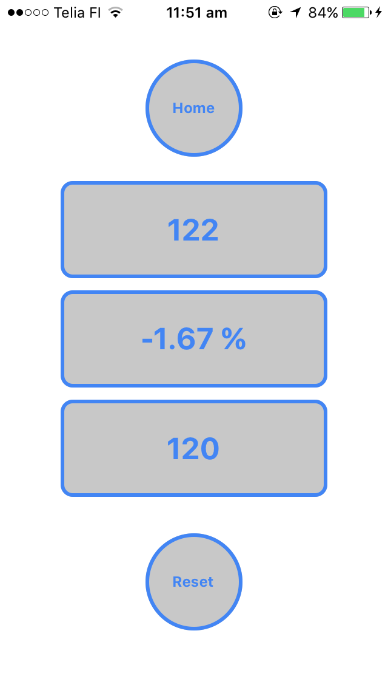

## MOBILE BPM

**A mobile app in React Native with 3 functions:**

+ click sound playback in chosen BPM;
+ BPM counter from clicks on a button;
+ comparing 2 user given BPM values, in %.

_(Issue: click playback out of sync)_

WORK IN PROGRESS

## Screenshots

**Home screen**

**Compare BPM screen**

